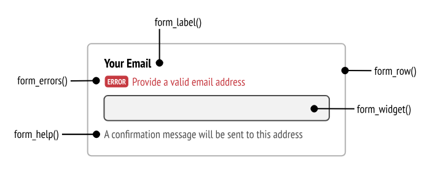
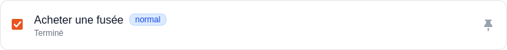

## Important Symfony concept 

- CSS Block : Utile pour ecrire du css à la main sur la page, il vaut mieux utilisé tailwind mais dans certain cas comme les formBuilder de symfony, il est plus simple d'utiliser du css à la main pour styliser les éléments.
```php

    <style>
        .form-control {
            border: 1px solid #ccc;
            padding: 10px;
            border-radius: 5px;
        }
    </style>

```

- `tailwind build --watch` : Permet de compiler le css de tailwind en temps réel, il faut lancer cette commande dans le terminal au démarrage de votre VSCode pour que les changements soient pris en compte quand vous codez votre application.

- `symfony console make:form` permet de créer un formulaire pour une entity, c'est utile pour les forumlaire de Creation et d'Edition d'un CRUD. Il est d'usage d'utiliser le même formulaire pour la création et l'édition d'une entité (d'une ligne SQL). La lecture et la suppression (R & D du CRUD) ne neccessite pas de formulaire. Un seul formulaire est donc finalement suffisant pour faire un CRUD.


- FormBuilder Attribute : Permet de définir entre autres les attributs HTML d'un champ de formulaire, comme la classe CSS, le placeholder, etc...
```php
<?php

class RegistrationFormType extends AbstractType
{
    public function buildForm(FormBuilderInterface $builder, array $options): void
    {
        $builder
            ->add('email', null, [ 
                'required' => true,     // Le champ est obligatoire
                'attr' => [             // Attributs HTML pour le champ
                    'placeholder' => 'votre@email.com',
                ],
            ])
            ->add('username', null, [
                'required' => true,     // Le champ est obligatoire
                'attr' => [             // Attributs HTML pour le champ
                    'placeholder' => 'nom_utilisateur',
                ],
            ])
            ->add('agreeTerms', CheckboxType::class, [
                'mapped' => false,
                'constraints' => [
                    new IsTrue(
                        message: 'You should agree to our terms.',
                    ),
                ],
            ])
            ->add('plainPassword', PasswordType::class, [
                // instead of being set onto the object directly,
                // this is read and encoded in the controller
                'mapped' => false,
                'attr' => [
                    'autocomplete' => 'new-password',
                    'placeholder' => '************',
                    ],
                'constraints' => [
                    new NotBlank(
                        message: 'Please enter a password',
                    ),
                    new Length(
                        min: 6,
                        minMessage: 'Your password should be at least {{ limit }} characters',
                        // max length allowed by Symfony for security reasons
                        max: 4096,
                    ),
                ],
            ])
        ;
    }

    public function configureOptions(OptionsResolver $resolver): void
    {
        $resolver->setDefaults([
            'data_class' => User::class,
        ]);
    }
}
```

- Afficher un champs de formulaire avec les helpers fonctions :  *https://symfony.com/doc/current/form/form_customization.html#form-rendering-functions*


- Form field CSS : Vous pouvez définir la classe CSS d'un champ de formulaire dans le FormBuilder avec l'attribut `attr` et la clé `class`. Par exemple, pour ajouter la classe `text-red` à un champ de formulaire nommé `level` et mettre le texte en rouge, vous pouvez faire comme suit :
```twig
{{ form_widget(form.level,{attr: {class: 'text-red'}}) }}
```
> Widget correspond à la balise input uniquement (ou select, textarea, etc...) tandis que row correspond à l'ensemble du champ de formulaire (label + widget + erreurs). Donc si vous voulez styliser uniquement la balise input, il faut utiliser form_widget.

- Ecrire un href : Utilisez la fonction `path()` dans votre template twig
```html
<a href="{{ path('app_login') }}">Login</a>
```

- Twig Component :
*installation*
```
compose require symfony/ux-twig-component
```
*création d'un component réutilisable*
``` 
symfony console make:twig-component IconButton
```

- J'ai oublier les commandes `symfony console`
```bash
symfony console list
```

- Faire une migration pour définir les lignes obligatoires de vos tables. Dans le projet TaskListReloaded ce sont les trois lignes pour ajouter les prioritées par défaut :
1. `symfony console doctrine:migrations:generate` pour créer une migration vide
2. Ajouter les requetes SQL neccessaire dans la méthode up() et les requetes SQL qui annule les changements dans la methode down()
```php
<?php

declare(strict_types=1);

namespace DoctrineMigrations;

use Doctrine\DBAL\Schema\Schema;
use Doctrine\Migrations\AbstractMigration;

/**
 * Auto-generated Migration: Please modify to your needs!
 */
final class Version20260331171843 extends AbstractMigration
{
    public function getDescription(): string
    {
        return '';
    }

    public function up(Schema $schema): void
    {
        // this up() migration is auto-generated, please modify it to your needs
        $this->addSql('INSERT INTO priority (level,importance) VALUES ("normal",0)');
        $this->addSql('INSERT INTO priority (level,importance) VALUES ("important",1)');
        $this->addSql('INSERT INTO priority (level,importance) VALUES ("urgent",2)');
    }

    public function down(Schema $schema): void
    {
        // this down() migration is auto-generated, please modify it to your needs
        $this->addSql('DELETE * FROM priority');
    }
}
```
3. Effectuer votre migration avec `symfony console doctrine:migrations:migrate`
> Souvenez vos que migrations migrate effectue toutes les migrations non-appliquées à la base de données dans leurs ordres de création.
> La dernière migration connu es défini dans la table doctrine_migrations_version de votre database. C'est ainsi que lors de la mises en production la commande `symfony console doctrine:migrations:migrate` est obligatoire pour appliquer tout votre shéma.
> Dit simplement : la somme des fichiers de migrations formes votre schema SQL, le même schéma qu'il fallait appliquer au démarrage de l'application avant que vous découvriez le principe des migrations.


- CSRF Formulaire sécurisé. Si vous modifier une donnée via un lien cliquable ou un formulaire vous etes exposée à une attaque CSRF (Cross Site Resources Forgery) qui permet à un attaquant de faire une requete sur votre site sans même que ce dernier soit sur votre site web. Le plus souvent, les attaques CSRF sont effectuées via des formulaires cachés sur d'autres sites internet scam qui redirigent vers une route de votre application.

Concerètement, prennont un formulaire qui permet de valider une tâche :
```html
    <form action="{{path('app_task_done',{id : id})}}" method="post">
        <input type="checkbox" onclick="this.form.submit()" {{ this.isDone ? "checked" : "" }} name="is_done" id="is_done" class=" w-4 h-4 bg-[#F3F3F5] border border-black/10 rounded-sm">
        <button class="btn"></button>
    </form>
```
*La tâche avant le clique sur la checkbox de validation*


Pour valider une tâche il suffit à l'utilisateur :
1. De ce connectée au site web (démarrage de la session donc)
2. De cliquer sur le bouton pour soumètre le formulaire à la route `POST /task/2/done`

Et ainsi la tâche est modifier dans la base de donnée ! Rien de plus simple.
*La tâche validée après l'envoie du formulaire à la route *


Maintenant une question se pose : "Si un autre site internet  ecrit contient lui aussi un formulaire qui redirige vers la route `http://localhost:8000/task/2/done` est ce que celà va fonctionner ?

La réponse est oui !

```html
<form action="http://localhost:8000/task/2/done" method="post">
    <input type="checkbox" onclick="this.form.submit()" name="is_done">
    <button class="btn"></button>
</form>
```

Ce formulaire peut être placé sur n'importe quel site internet, et **tant que l'utilisateur c'est déjà connecté à votre application**, il peut soumettre ce formulaire et ainsi modifier les données de votre application sans même être sur votre site web ! C'est ce qu'on appelle une attaque CSRF.

Pour éviter ce genre d'attaque, Symfony utilise un système de token CSRF. Lorsque vous créez un formulaire avec Symfony, un token CSRF est automatiquement généré et ajouté au formulaire. Ce token est unique pour chaque session utilisateur et est vérifié à chaque soumission de formulaire. Si le token n'est pas présent ou est invalide, la soumission du formulaire est rejetée.

C'est le cas des formlaires crée avec les helpers fonctions form(), form_start(), form_end() de twig. **Mais si vous crée une formulaire à la main, vous devez ajouter le token CSRF manuellement.**

***La solution*** : Ajouter un champ caché dans votre formulaire qui contient le token CSRF généré par Symfony. Vous pouvez générer ce token dans votre contrôleur et le passer à votre template Twig, puis l'inclure dans votre formulaire, grâce à la fonction `csrf_token()` dans Twig comme suit :
```html
<form action="{{path('app_task_done',{id : id})}}" method="post">
    
    <input type="hidden" name="token" value="{{ csrf_token('task_done') }}">

    <input type="checkbox" onclick="this.form.submit()" {{ this.isDone ? "checked" : "" }} name="is_done" id="is_done" class=" w-4 h-4 bg-[#F3F3F5] border border-black/10 rounded-sm">
    <button class="btn"></button>
</form>
```


## Comment lire la documentation de Symfony

- Symfony Docs : Le style FAQ est très pédagogique, il explique les concepts de manière simple et claire, avec des exemples concrets. **ATTENTION UTILISEZ LE SOMMAIRES SINON VOUS ALLEZ JAMAIS** : https://symfony.com/doc

- Symfony Réference : Liste exhaustive de toutes paramètres des fichiers yaml, des fonctions, etc... C'est plus technique et moins pédagogique que la documentation mais c'est très utilile pour ne pas cherche sur google la syntaxe d'un paramètre ou d'une fonction : https://symfony.com/doc/current/reference/index.html

